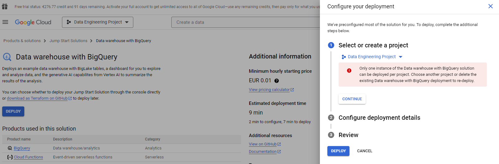
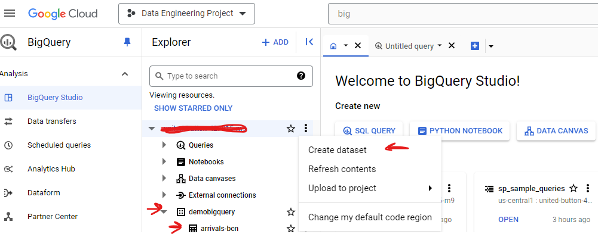
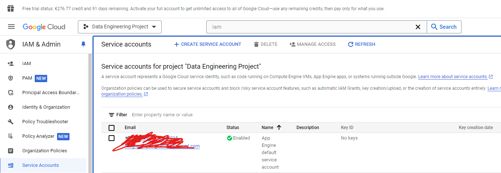
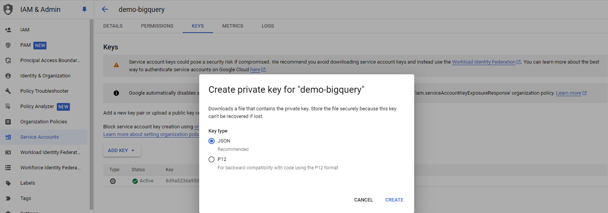
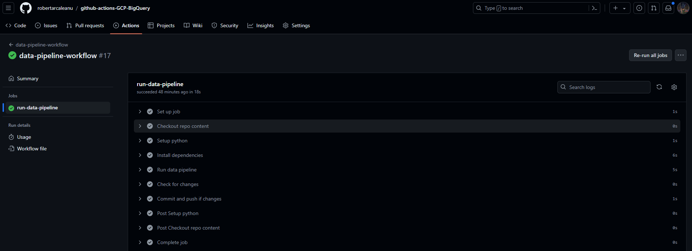
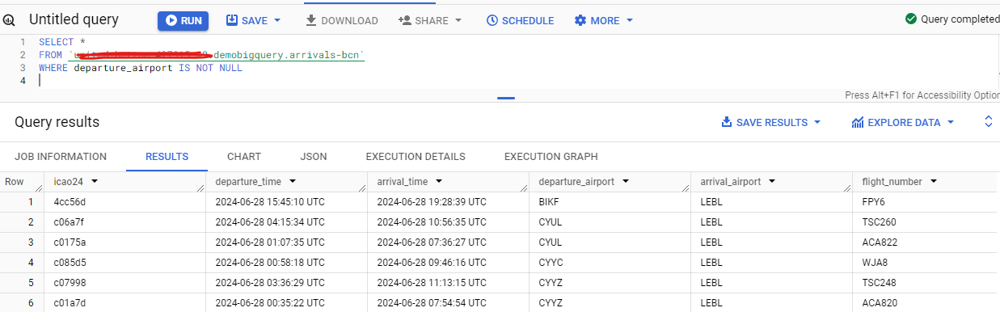
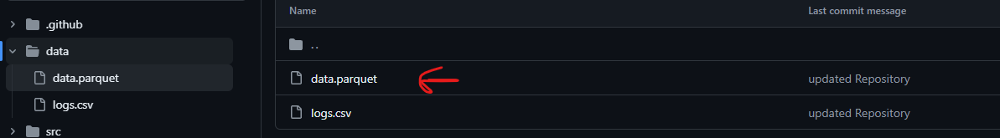

# ETL with Github Actions and GCP
This repository consists of a project that extracts data automatically using github actions and loads it to BigQuery (GCP).

## Data Extraction

The data is retrieved from the [OpenSky REST API](https://openskynetwork.github.io/opensky-api/rest.html). In this particular case, we are using the `GET /flights/arrival` endpoint to obtain the daily arrivals to the Barcelona Airport (BCN, LEBL).

## Pipeline Automation

In order to make automate the pipeline and execute it daily, we are using Github Actions to automate the process. To do so, it is necessary to create this directory (`.github/workflows`) where the workflow is defined in a `.yml` format.

This project follows the steps indicated in [this](https://github.com/ShawhinT/data-pipeline-example?tab=readme-ov-file) repository. The main steps that have been followed are listed below:

1. Define workflow name
2. Define when to execute the workflow (manually or on schedule)
3. Define the job

    1. Define OS to run on
    2. Define the steps 

## Data Storage
In this section we provide the two options that have been chosen to store the data.

### Local Storage
Initially, the data is stored locally as it is easier to configure. The data can be found in `data/data.parquet` file. The data is a table with the following columns:

* icao24
* departure_time
* arrival_time
* departure_airport
* arrival_airport
* flight_number

In this case, the data is stored in a parquet file. Youn can read about its benefits [here](https://parquet.apache.org/).

### GCP
Usually, companies rely on Cloud Datawarehouses to store their data. There are different options in the market, such as Snowflake, AWS Redshift, Databricks, BigQuery, among others.

For the purpose of this project, we are using BigQuery. BigQuery is a serverless data warehouse provided by GCP. This was my first time using GCP, so it required to create a new account and set up the Data Warehouse. All the steps I followed are listed below:

1. **Creating GCP Account**: go to [this](https://cloud.google.com/free?hl=en) page and click on *Try it in console*
2. **Creating new project**: you can create project by going to this part of the console


3. **Deploying BigQuery**: afterwards, we can go to BigQuery and deploy it by following the steps.



4. **Creating Dataset and Tables**: in order to store data it is necessary to create a dataset and a table. In this case, we select the three dots and create the dataset and the table. Note that the dataset is created within the data warehouse, while the table is created within the dataset. 



5. **Getting credentials**: in order to load data into BigQuery using Python, we need to configure the necessary credentials. These are stored in a JSON file that is read when executing the pipeline. Firstly, we need to go IAM & Admin > Service Accounts and create a service account.



Then, we select the service account we have created and go to the Keys tab to create a key.



6. **Loading data:** GCP has a Python package that makes very easy to load data into BigQuery. In this case, we are loading the data from a parquet format.

```Python
client = bigquery.Client(credentials=credentials)

with io.BytesIO() as stream:
    self.df.write_parquet(stream)
    stream.seek(0)
    job = client.load_table_from_file(
        stream,
        destination=f'{PROJECT_ID}.demobigquery.arrivals-bcn', # table ID
        project=PROJECT_ID,
        job_config=bigquery.LoadJobConfig(
            source_format=bigquery.SourceFormat.PARQUET,
            
        ),
    )
job.result()
```


Finally, we can see that the workflow is executed and the data is available in both the Github Repository and the Data Warehouse (BigQuery).

Example of the Github Actions workflow execution:



Last but not least, an evidence that the data is stored correctly.


